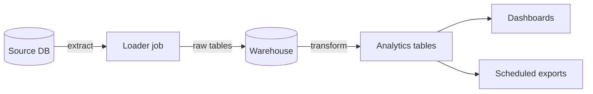

# Example data pipeline

> **Source of truth:** the [`example-pipeline`](https://example.com/acme/example-pipeline)
> repo. This page covers only how the pipeline connects to other systems. For setup,
> configuration, and run instructions, see that repo's `README`.

**What it does:** once a night, it pulls records from the source database, transforms them in
the warehouse, and publishes analytics-ready tables that downstream tools read from.

## Flow

## How it connects

- **Source DB → Loader.** The loader reads on a read-replica connection so it never competes
  with production writes.
- **Loader → Warehouse.** Raw tables land first; transforms run after the load completes, so a
  partial load never produces partial analytics.
- **Warehouse → consumers.** Dashboards and scheduled exports read only the published
  analytics tables, never the raw layer — that boundary is what lets the raw schema change
  without breaking consumers.

## Operating it

When the nightly run fails or is late, see the runbook:
[Restart a stuck job](../runbooks/restart-a-stuck-job.md).

## Related

- Catalog entry and repo link: [`registry.yml`](registry.yml).
